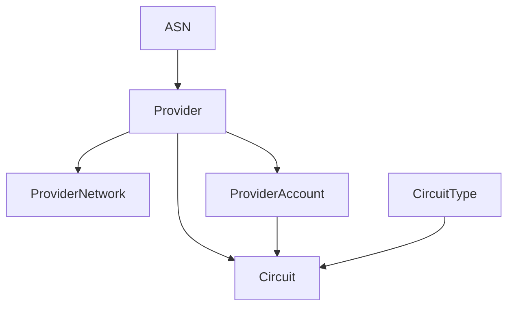

# 회선

NetBox는 네트워크의 트랜짓 및 피어링 제공업체와 회선을 관리하는 데 이상적입니다. 데이터 센터와 엔터프라이즈 환경 모두에서 물리적 회선을 모델링하는 데 필요한 모든 유연성을 제공하며, 케이블을 통해 회선을 장비 인터페이스에 직접 "연결"할 수 있습니다.

## 제공업체

제공업체는 인터넷 또는 사설 연결을 제공하는 모든 조직입니다. 일반적으로 대형 통신사이지만 지역 제공업체 또는 내부 서비스일 수도 있습니다. 각 제공업체에는 계정 및 연락처 정보를 할당할 수 있으며 하나 이상의 AS 번호가 할당될 수 있습니다.

때때로 완전한 가시성이 없는 제공업체 네트워크를 모델링해야 합니다. 이러한 네트워크는 일반적으로 토폴로지 다이어그램에서 클라우드 아이콘으로 표시됩니다. NetBox는 제공업체 네트워크 모델을 통해 이를 용이하게 합니다: 제공업체 네트워크는 회선이 연결될 수 있는 "블랙 박스" 네트워크를 나타냅니다. 일반적인 예는 여러 사이트를 연결하는 제공업체 MPLS 네트워크입니다.

## 회선

회선은 두 지점 사이의 물리적 연결로, 외부 제공업체가 설치하고 유지 관리합니다. 예를 들어 광섬유 케이블로 제공되는 인터넷 연결은 NetBox에서 회선으로 모델링됩니다.

각 회선은 제공업체와 연결되고 해당 제공업체에 고유해야 하는 회선 ID가 할당됩니다. 회선에는 사용자 정의 유형, 운영 상태 및 기타 다양한 운영 특성도 할당됩니다. 제공업체 계정을 사용하여 공통 제공업체에 속한 회선을 추가로 분류할 수도 있습니다: 이러한 계정은 다른 사업부 또는 기술을 나타낼 수 있습니다.

각 회선에는 최대 두 개의 종단(A와 Z)이 정의될 수 있습니다. 각 종단은 특정 사이트 또는 제공업체 네트워크와 연결될 수 있습니다. 전자의 경우 회선 종단과 장비 구성 요소 사이에 케이블을 연결하여 물리적 연결을 매핑할 수 있습니다.

!!! warning "물리적 회선 vs. 가상 회선"
    NetBox의 회선 모델은 **물리적** 연결을 나타냅니다. 물리적 인프라 위에 오버레이되어 제공업체가 제공하는 _가상_ 회선과 혼동하지 마세요. (예를 들어 VLAN 태그가 지정된 서브인터페이스는 가상 회선이 됩니다.) 좋은 경험 법칙: 가리킬 수 없다면 물리적 회선이 아닙니다.
