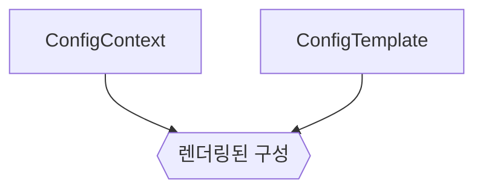

# 구성 렌더링

네트워크 운영의 중요한 측면 중 하나는 모든 네트워크 노드가 올바르게 구성되었는지 확인하는 것입니다. 구성 템플릿과 [컨텍스트 데이터](./context-data.md)를 활용하여 NetBox는 네트워크의 각 장비에 대한 전체 구성 파일을 렌더링할 수 있습니다.



## 구성 템플릿

구성 템플릿은 [Jinja2 템플릿 언어](https://jinja.palletsprojects.com/)로 작성되며 원격 데이터 소스에서 자동으로 채워질 수 있습니다. 컨텍스트 데이터는 렌더링 중에 템플릿에 적용되어 완전한 구성 파일을 출력합니다. 아래는 간단한 네트워크 스위치 구성 파일을 렌더링하는 Jinja2 템플릿의 예입니다.

```jinja2



    system {
        host-name {{ device.name }};
        domain-name example.com;
        time-zone UTC;
        authentication-order [ password radius ];
        ntp {
            
                server {{ server }};
            
        }
    }
    
        
    

```

특정 NetBox 장비에 대해 렌더링하면 템플릿의 `device` 변수가 장비 인스턴스로 채워지고 `ntp_servers`는 장비의 사용 가능한 컨텍스트 데이터에서 가져옵니다. 결과 출력은 호환되는 네트워크 장비에 직접 적용할 수 있는 유효한 구성 세그먼트가 됩니다.

### 컨텍스트 데이터

구성이 렌더링되는 객체는 장비와 가상 머신에 대해 각각 `device` 또는 `virtualmachine`으로 템플릿 컨텍스트에서 사용할 수 있습니다. 또한 NetBox 모델 클래스는 해당 앱 또는 플러그인에서 접근할 수 있습니다. 예:

```
There are {{ dcim.Site.objects.count() }} sites.
```

## 템플릿 렌더링

### 장비 구성

NetBox는 특정 장비의 기본 구성 템플릿을 렌더링하기 위한 REST API 엔드포인트를 제공합니다. 이는 장비의 고유 URL에 POST 요청을 보내고 선택적으로 추가 컨텍스트 데이터를 포함하여 수행됩니다.

```no-highlight
curl -X POST \
-H "Authorization: Token $TOKEN" \
-H "Content-Type: application/json" \
-H "Accept: application/json; indent=4" \
http://netbox:8000/api/dcim/devices/123/render-config/ \
--data '{
  "extra_data": "abc123"
}'
```

이 요청은 다음 순서로 장비의 선호 구성 템플릿 해결을 트리거합니다:

* 개별 장비에 할당된 구성 템플릿
* 장비의 역할에 할당된 구성 템플릿
* 장비의 플랫폼에 할당된 구성 템플릿

이 세 객체 중 어느 것에도 구성 템플릿이 할당되지 않은 경우 요청은 실패합니다.

구성은 `Accept:` HTTP 헤더를 설정하여 JSON 또는 일반 텍스트로 렌더링할 수 있습니다. 예:

* `Accept: application/json`
* `Accept: text/plain`

### 범용 사용

NetBox 구성 템플릿은 별도의 범용 REST API 엔드포인트를 사용하여 특정 장비에 연결되지 않고도 렌더링할 수 있습니다. 이 엔드포인트에 대한 POST 요청에 포함된 모든 데이터는 템플릿의 컨텍스트 데이터로 전달됩니다.

```no-highlight
curl -X POST \
-H "Authorization: Token $TOKEN" \
-H "Content-Type: application/json" \
-H "Accept: application/json; indent=4" \
http://netbox:8000/api/extras/config-templates/123/render/ \
--data '{
  "foo": "abc",
  "bar": 123
}'
```
