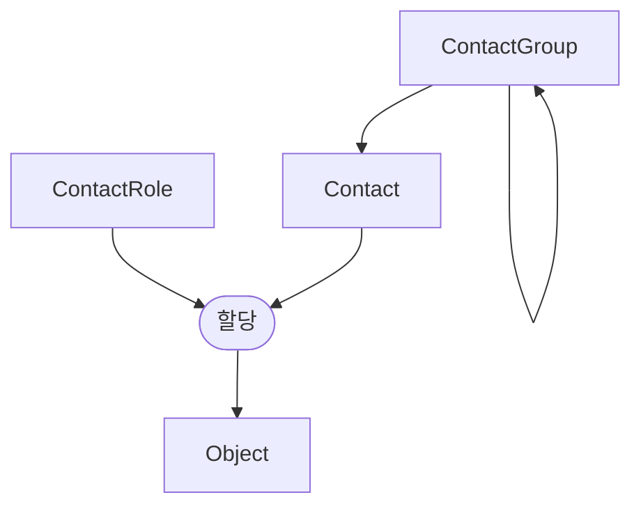

# 연락처

[테넌시](./tenancy.md)와 마찬가지로 연락처 할당을 통해 NetBox에서 모델링된 리소스의 소유권을 추적할 수 있습니다. 연락처는 할당된 역할의 컨텍스트 내에서 리소스를 담당하는 개인을 나타냅니다.

## 연락처 그룹

연락처는 재귀적 계층 구조로 임의로 그룹화할 수 있으며, 연락처는 계층 구조 내 어느 수준의 그룹에든 할당될 수 있습니다.

## 연락처 역할

연락처 역할은 할당된 객체에 대한 연락처의 관계를 정의합니다. 예를 들어 관리, 운영 및 긴급 연락처에 대한 역할을 정의할 수 있습니다.

## 연락처

연락처는 개인 또는 영구적인 연락 지점을 나타내야 합니다. 각 연락처는 이름을 정의해야 하며 선택적으로 직함, 전화번호, 이메일 주소 및 관련 세부 정보를 포함할 수 있습니다.

연락처는 할당에 재사용되므로 각 고유 연락처는 한 번만 생성하면 되며 원하는 수의 NetBox 객체에 할당할 수 있고, 객체가 가질 수 있는 할당된 연락처 수에는 제한이 없습니다. NetBox의 대부분의 핵심 객체에 연락처를 할당할 수 있습니다.

다음 모델은 연락처 할당을 지원합니다:

* circuits.Circuit
* circuits.Provider
* circuits.ProviderAccount
* dcim.Device
* dcim.Location
* dcim.Manufacturer
* dcim.PowerPanel
* dcim.Rack
* dcim.Region
* dcim.Site
* dcim.SiteGroup
* tenancy.Tenant
* virtualization.Cluster
* virtualization.ClusterGroup
* virtualization.VirtualMachine
