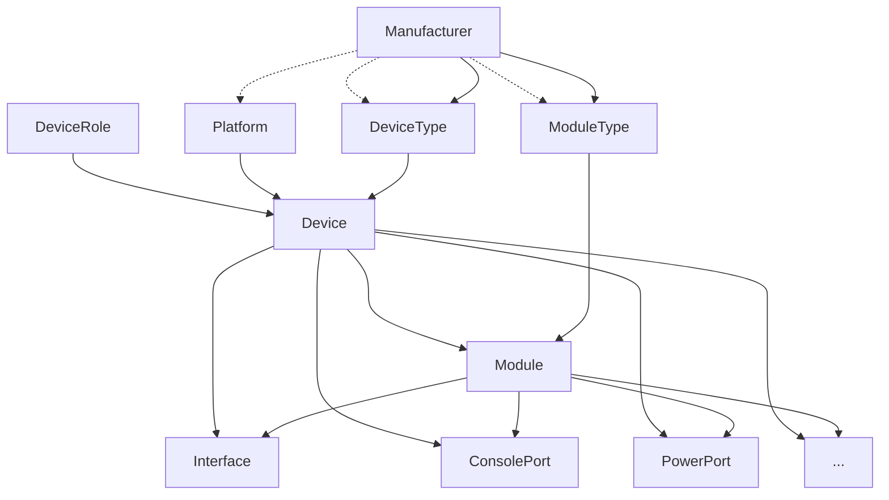
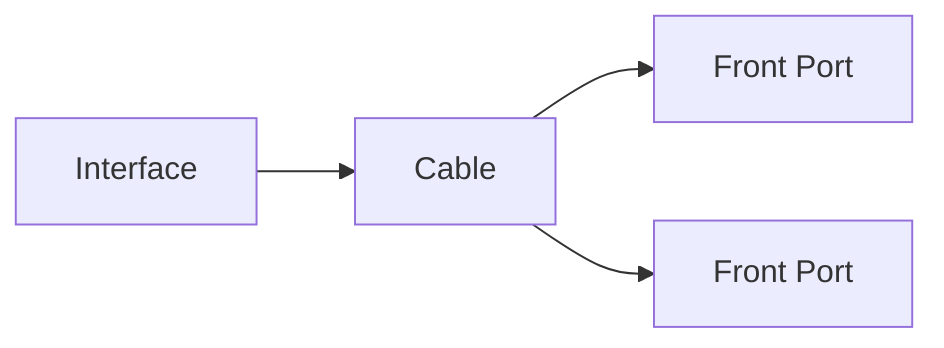

# 장비 및 케이블링

NetBox의 핵심은 네트워크 인프라를 모델링하는 도구이며, 장비 객체는 이 기능의 핵심입니다. 장비는 서버, 라우터 또는 스위치와 같이 네트워크 내에 설치된 모든 물리적 하드웨어일 수 있으며, 선택적으로 랙 내에 장착될 수 있습니다. 각 장비 내에서 네트워크 인터페이스 및 콘솔 포트와 같은 리소스는 개별 구성 요소로 모델링되며, 선택적으로 모듈로 그룹화할 수 있습니다.

NetBox는 장비 유형을 사용하여 고유한 실제 장비 모델을 나타냅니다. 이를 통해 사용자는 장비 유형과 모든 구성 요소를 한 번 정의하고 무제한의 장비 인스턴스를 쉽게 복제할 수 있습니다.

## 제조업체

제조업체는 일반적으로 하드웨어 장비를 생산하는 조직을 나타냅니다. 이는 사용자가 정의할 수 있지만 추상적인 아이디어가 아닌 실제 엔티티를 나타내야 합니다.

## 장비 유형

장비 유형은 실제 세계에 존재하는 개별 제조사와 장비 모델에 매핑되는 제조업체와 하드웨어 모델의 고유한 조합을 나타냅니다. 각 장비 유형에는 일반적으로 네트워크 인터페이스, 장비 베이 등을 나타내는 여러 구성 요소가 생성됩니다. 그런 다음 이 유형의 새 장비를 NetBox에서 생성할 수 있으며 관련 구성 요소가 장비 유형에서 자동으로 복제됩니다. 이렇게 하면 NetBox에 추가할 때 각 장비에 대해 구성 요소를 지루하게 다시 만들 필요가 없습니다.

!!! tip "장비 유형 라이브러리"
    사용자는 항상 NetBox에서 자체 장비 유형을 자유롭게 만들 수 있지만, 많은 사람들이 사전 정의된 장비 유형의 [커뮤니티 라이브러리](https://github.com/netbox-community/devicetype-library)를 활용하는 것이 편리하다고 생각합니다. 이는 특정 제조사와 장비 모델이 보편적으로 적용 가능하고 변경되지 않기 때문에 가능합니다.

다음은 모두 구성 요소로 모델링할 수 있습니다:

* 인터페이스
* 콘솔 포트
* 콘솔 서버 포트
* 전원 포트
* 전원 콘센트
* 패스스루 포트(전면 및 후면)
* 모듈 베이(모듈을 수용)
* 장비 베이(자식 장비를 수용)

예를 들어 Juniper EX4300-48T 장비 유형에는 다음 구성 요소 템플릿이 정의될 수 있습니다:

* 콘솔 포트에 대한 하나의 템플릿("Console")
* 전원 포트에 대한 두 개의 템플릿("PSU0" 및 "PSU1")
* 1GE 인터페이스에 대한 48개의 템플릿("ge-0/0/0" ~ "ge-0/0/47")
* 10GE 인터페이스에 대한 네 개의 템플릿("xe-0/2/0" ~ "xe-0/2/3")

구성 요소 템플릿이 생성되면 이 유형의 인스턴스로 생성하는 모든 새 장비에 위에 나열된 각 구성 요소가 자동으로 할당됩니다.

!!! note "구성 요소 인스턴스화는 소급 적용되지 않음"
    장비 유형 정의에서 구성 요소 인스턴스화는 장비 생성 시에만 발생합니다. 장비 유형에 할당된 구성 요소를 수정해도 이미 생성된 장비에는 영향을 미치지 않습니다. 이는 기존 장비에 대한 의도치 않은 변경을 방지합니다. 그러나 기존 장비에서 구성 요소를 추가, 수정 또는 삭제하는 옵션은 항상 있습니다. (이러한 변경은 UI에서 사용 가능한 대량 작업을 사용하여 여러 장비에 한 번에 쉽게 적용할 수 있습니다.)

## 장비

장비 유형이 장비의 제조사와 모델을 정의하는 반면, 장비 자체는 실제 세계 어딘가에 설치된 실제 하드웨어 조각을 나타냅니다. 장비는 장비 랙 내의 특정 위치에 설치되거나 단순히 사이트(및 선택적으로 해당 사이트 내의 위치)와 연결될 수 있습니다.

각 장비에는 운영 상태, 기능적 역할 및 소프트웨어 플랫폼이 할당될 수 있습니다. 장비 구성 요소는 생성 시 할당된 장비 유형에서 자동으로 인스턴스화됩니다.

### 가상 섀시

때때로 물리적 장비 세트를 단일 관리 평면을 공유하는 것으로 모델링해야 합니다. 이러한 시나리오의 가장 일반적인 예는 스택 가능 스위치입니다. 이는 NetBox에서 가상 섀시로 모델링할 수 있으며, 하나의 장비가 섀시 마스터로 작동하고 나머지는 멤버로 작동합니다. 멤버 장비의 모든 구성 요소가 마스터에 나타납니다.

### 가상 장비 컨텍스트

가상 장비 컨텍스트(VDC)는 장비 내의 논리적 파티션입니다. 각 VDC는 자율적으로 작동하지만 공통 리소스 풀을 공유합니다. 각 인터페이스는 해당 장비의 하나 이상의 VDC에 할당될 수 있습니다.

## 모듈 유형 및 모듈

장비 유형과 장비와 마찬가지로 모듈 유형은 장비 내에 설치되는 하드웨어 구성 요소인 개별 모듈을 인스턴스화할 수 있습니다. 모듈에는 종종 부모 장비에서 사용할 수 있게 되는 자체 자식 구성 요소가 있습니다. 예를 들어 NetBox에서 여러 라인 카드가 있는 섀시 기반 스위치를 모델링할 때 섀시는 장비(장비 유형에서)로 생성되고 각 라인 카드는 장비의 모듈 베이 중 하나에 설치된 모듈(모듈 유형에서)로 인스턴스화됩니다.

!!! tip "장비 베이 vs. 모듈 베이"
    장비 베이와 모듈 베이의 차이점은 무엇입니까? 장비 베이는 설치된 하드웨어가 부모 장비에서 격리된 자체 관리 평면을 가질 때 적합합니다. 일반적인 예는 블레이드가 전원을 공유하지만 독립적으로 작동하는 블레이드 서버 섀시입니다. 반면에 모듈 베이는 위에서 언급한 섀시 스위치 라인 카드 예와 같이 부모 장비와 독립적으로 작동하지 _않는_ 모듈을 보유합니다.

모듈의 특히 좋은 기능 중 하나는 부모 모듈이 설치된 모듈 베이에 따라 템플릿화된 구성 요소의 이름이 자동으로 변경될 수 있다는 것입니다. 예를 들어 `Gi{module}/0/1-48`이라는 인터페이스가 있는 모듈 유형을 만들고 이 유형의 모듈을 장비의 모듈 베이 7에 설치하면 NetBox는 `Gi7/0/1-48`이라는 인터페이스를 생성합니다.

## 케이블

NetBox는 케이블을 특정 유형의 장비 구성 요소 및 기타 객체 간의 연결로 모델링합니다. 각 케이블에는 유형, 색상, 길이 및 레이블을 할당할 수 있습니다. NetBox는 잘못된 연결을 방지하기 위해 기본적인 정합성 검사를 시행합니다. (예를 들어 네트워크 인터페이스는 전원 콘센트에 연결할 수 없습니다.)

케이블의 양 끝은 동일한 유형의 여러 객체로 종단될 수 있습니다. 예를 들어 네트워크 인터페이스는 광섬유 케이블을 통해 패치 패널의 두 개의 개별 포트에 연결될 수 있습니다(각 포트는 패치 케이블의 개별 광섬유 가닥에 연결됨).

