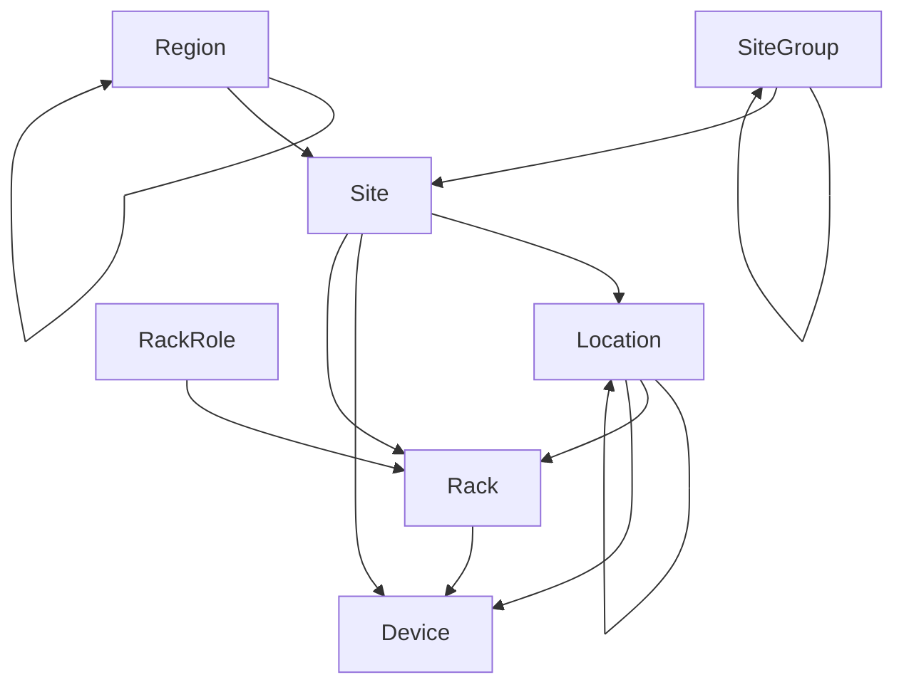

# 시설

전역 지역부터 개별 장비 랙까지 NetBox를 사용하면 네트워크의 전체 존재를 모델링할 수 있습니다. 이는 여러 목적별 모델을 사용하여 수행됩니다. 아래 그래프는 이러한 모델과 그 관계를 보여줍니다.

## 지역

지역은 네트워크 또는 고객이 존재하는 지리적 도메인을 나타냅니다. 일반적으로 국가, 주 및 도시를 모델링하는 데 사용되지만, NetBox는 정확한 사용법을 규정하지 않으므로 필요에 따라 다를 수 있습니다.

지역은 자체 중첩이 가능하므로 부모 내에 자식 지역을 정의하고 각 자식 내에 손자를 정의할 수 있습니다. 예를 들어 다음과 같은 계층 구조를 만들 수 있습니다:

* 유럽
    * 프랑스
    * 독일
    * 스페인
* 북미
    * 캐나다
    * 미국
        * 캘리포니아
        * 뉴욕
        * 텍사스

지역은 항상 각 부모 내에서 이름별로 알파벳순으로 나열되며 계층 구조의 최대 깊이는 없습니다.

## 사이트 그룹

지역과 마찬가지로 사이트 그룹은 사이트를 그룹화하기 위해 재귀적 계층 구조로 배열할 수 있습니다. 그러나 지역이 지리적 조직을 위한 것인 반면, 사이트 그룹은 기능적 그룹화에 사용될 수 있습니다. 예를 들어 물리적 위치 외에도 사이트를 본사, 지사 또는 고객 사이트로 분류할 수 있습니다.

지역과 사이트 그룹을 모두 사용하면 사이트를 구성할 수 있는 두 가지 독립적이지만 상호 보완적인 차원을 제공합니다.

## 사이트

사이트는 일반적으로 지역 및/또는 사이트 그룹 내의 건물을 나타냅니다. 각 사이트에는 운영 상태(예: active 또는 planned)가 할당되며, 개별 우편 주소와 GPS 좌표가 할당될 수 있습니다.

## 위치

위치는 층 또는 방과 같은 건물 내의 논리적 하위 구역일 수 있습니다. 지역 및 사이트 그룹과 마찬가지로 위치는 최대한의 유연성을 위해 자체 재귀적 계층 구조로 중첩될 수 있습니다. 그리고 사이트와 마찬가지로 각 위치에는 운영 상태가 할당됩니다.

## 랙 유형

랙 유형은 실제 세계에 존재하는 랙의 고유한 사양을 나타냅니다. 각 랙 유형은 무게, 높이 및 유닛 순서로 설정할 수 있습니다. 그런 다음 이 유형의 새 랙을 NetBox에서 생성할 수 있으며 관련 사양이 장비 유형에서 자동으로 복제됩니다.

## 랙

마지막으로 NetBox는 각 장비 랙을 사이트 및 위치 내의 개별 객체로 모델링합니다. 이것은 장비가 설치되는 물리적 객체입니다. 각 랙에는 운영 상태, 유형, 시설 ID 및 재고 추적과 관련된 기타 속성을 할당할 수 있습니다. 각 랙은 또한 높이(랙 유닛 단위)와 너비를 정의해야 하며, 선택적으로 물리적 치수를 지정할 수 있습니다.

각 랙은 사이트와 연결되어야 하지만 해당 사이트 내의 위치에 대한 할당은 선택 사항입니다. 사용자는 랙을 할당할 수 있는 사용자 정의 역할도 만들 수 있습니다. NetBox는 반 유닛 단위로 랙 공간 추적을 지원하므로 예를 들어 랙 내 위치 2.5에 장비를 장착할 수 있습니다.

!!! tip "장비"
    위의 다이어그램에서 장비가 사이트, 위치 또는 랙 내에 설치될 수 있음을 알 수 있습니다. 이 접근 방식은 모든 사이트가 자식 위치를 정의할 필요가 없고 모든 장비가 랙에 있지 않기 때문에 많은 유연성을 제공합니다.
