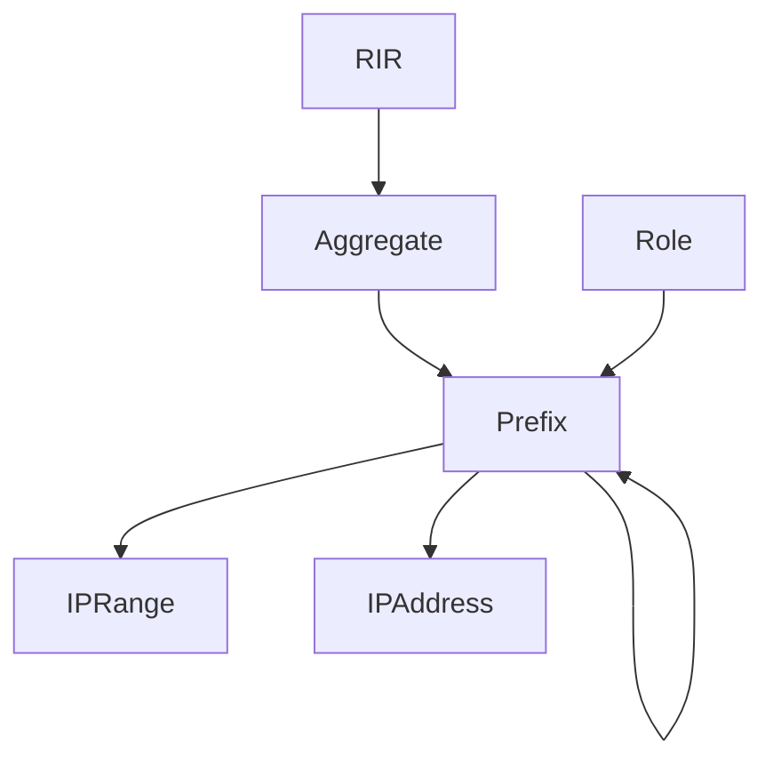

# IP 주소 관리

IP 주소 관리(IPAM)는 NetBox의 핵심 기능 중 하나입니다. IP4 및 IPv6에 대한 완전한 동등성, 고급 VRF 할당, 자동 계층 구조 형성 등을 지원합니다.

## IP 계층 구조

NetBox는 IP 리소스의 계층 구조를 나타내기 위해 여러 객체 유형을 사용합니다:

* **Aggregate(집합)** - 주소 지정 계층의 루트를 나타내는 프리픽스입니다. 이는 일반적으로 조직에서 사용하도록 할당된 대규모 공용 또는 사설 주소 공간입니다. 각 집합은 권위 있는 RIR에 할당됩니다.
* **Prefix(프리픽스)** - 집합 내에 정의된 서브넷입니다. 프리픽스는 서로 중첩되어 계층을 확장합니다. (예를 들어 192.168.123.0/24는 192.168.0.0/16 내에 나타납니다.) 각 프리픽스에는 기능적 역할과 운영 상태가 할당될 수 있습니다.
* **IP Range(IP 범위)** - 프리픽스 내의 동일한 마스크를 공유하는 개별 IP 주소의 임의 범위입니다. 범위는 일반적으로 DHCP 스코프와 관련되지만 유사한 목적으로 사용될 수 있습니다.
* **IP Address(IP 주소)** - 서브넷 마스크와 함께 부모 프리픽스 아래에 자동으로 배열되는 개별 IP 주소입니다.

!!! tip "자동 계층 구조"
    NetBox의 IP 객체는 부모 객체에 수동으로 할당할 필요가 없습니다. 계층 구조의 구성은 IP 주소 지정의 고유 규칙에 따라 애플리케이션에서 자동으로 처리됩니다.

예제 계층 구조는 다음과 같이 보일 수 있습니다:

* 100.64.0.0/10 (집합)
    * 100.64.0.0/20 (프리픽스)
    * 100.64.16.0/20 (프리픽스)
        * 100.64.16.0/24 (프리픽스)
            * 100.64.16.1/24 (주소)
            * 100.64.16.2/24 (주소)
            * 100.64.16.3/24 (주소)
        * 100.64.19.0/24 (프리픽스)
    * 100.64.32.0/20 (프리픽스)
        * 100.64.32.1/24 (주소)
        * 100.64.32.10-99/24 (범위)

## 사용률 통계

각 프리픽스의 사용률은 상태에 따라 자동으로 계산됩니다. _컨테이너_ 프리픽스는 자식 프리픽스를 포함하는 프리픽스입니다. 이들의 사용률은 사용 가능한 IP 공간 중 자식 프리픽스가 소비한 양에 따라 결정됩니다. 다른 유형의 프리픽스의 사용률은 정의된 모든 자식 IP 주소 및/또는 범위의 총 사용량에 의해 결정됩니다.

마찬가지로 집합의 사용률은 자식 프리픽스가 소비한 공간에 따라 결정됩니다.

## VRF 추적

NetBox는 중복되는 주소 공간을 포함하여 여러 라우팅 테이블을 나타내기 위해 개별 가상 라우팅 및 포워딩(VRF) 인스턴스의 모델링을 지원합니다. 집합 내의 각 IP 객체 유형(프리픽스, IP 범위 및 IP 주소)은 특정 VRF에 할당될 수 있습니다. 결과적으로 각 VRF는 자체 격리된 IP 계층을 유지합니다. 이를 통해 중복 IP 공간을 매우 쉽게 추적할 수 있습니다.

NetBox의 VRF 모델링은 실제 네트워크 구성에서 찾을 수 있는 것과 매우 유사하며, 각 VRF에는 표준 호환 라우트 구분자가 할당됩니다. VRF 간에 라우팅 정보의 가져오기 및 내보내기를 관리하기 위해 라우트 타겟을 만들 수도 있습니다.

!!! tip "고유 IP 공간 적용"
    각 VRF는 중복 IP 객체를 허용하거나 금지하도록 독립적으로 구성할 수 있습니다. 예를 들어 고유 IP 공간을 적용하도록 구성된 VRF는 두 개의 192.0.2.0/24 프리픽스 생성을 허용하지 않습니다. VRF별로 이 제한을 전환할 수 있는 기능은 사용자에게 IP 공간 모델링에 최대한의 유연성을 제공합니다.

## AS 번호

종종 간과되는 IPAM 구성 요소인 NetBox는 자율 시스템(AS) 번호와 사이트에 대한 할당도 추적합니다. 16비트 및 32비트 AS 번호가 모두 지원되며, 집합과 마찬가지로 각 ASN은 권위 있는 RIR에 할당됩니다.

## 애플리케이션 서비스 매핑

NetBox는 네트워크 애플리케이션을 장비 및/또는 가상 머신과 연결되고 선택적으로 해당 부모 객체에 연결된 특정 IP 주소와 연결된 개별 서비스 객체로 모델링합니다. 이를 통해 다른 객체 또는 통합 도구에서 참조할 수 있도록 네트워크에서 실행 중인 애플리케이션을 카탈로그화할 수 있습니다.

NetBox에서 애플리케이션 서비스를 모델링하려면 서비스가 수신하는 이름, 프로토콜 및 포트 번호를 정의하는 애플리케이션 서비스 템플릿을 만드는 것으로 시작합니다. 그런 다음 이 템플릿을 쉽게 인스턴스화하여 새 서비스를 장비 또는 가상 머신에 "연결"할 수 있습니다. 템플릿 없이 수동으로 새 애플리케이션 서비스를 만들 수도 있지만 이 방법은 지루할 수 있습니다.
