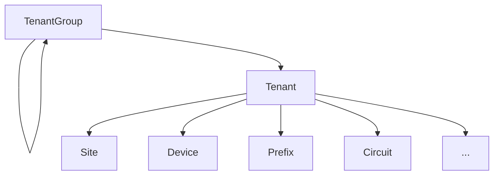

# 테넌시

NetBox 데이터 모델 내의 대부분의 핵심 객체는 _테넌시_를 지원합니다. 이는 소유권 또는 종속성을 전달하기 위해 객체를 특정 테넌트와 연결하는 것입니다. 예를 들어 기업은 내부 사업부를 테넌트로 나타낼 수 있고, 관리 서비스 제공업체는 각 고객을 나타내기 위해 NetBox에 테넌트를 만들 수 있습니다.

## 테넌트 그룹

테넌트는 사용 사례에서 요구하는 모든 논리에 따라 그룹화할 수 있으며, 그룹은 최대한의 유연성을 위해 재귀적으로 중첩될 수 있습니다. 예를 들어 "현재" 및 "과거" 자식 그룹이 있는 상위 "고객" 그룹을 정의할 수 있습니다. 테넌트는 계층 구조 내 어느 수준의 그룹에든 할당될 수 있습니다.

## 테넌트

일반적으로 테넌트 모델은 고객 또는 내부 조직을 나타내는 데 사용되지만, 필요에 맞는 어떤 목적으로든 사용할 수 있습니다.

NetBox 내의 대부분의 핵심 객체를 특정 테넌트에 할당할 수 있으므로 이 모델은 객체 유형 간에 소유권을 상호 연관시키는 매우 편리한 방법을 제공합니다. 예를 들어 각 고객은 자체 랙, 장비, IP 주소, 회선 등을 가질 수 있습니다: 이 모든 것은 테넌트 할당을 통해 쉽게 추적할 수 있습니다.

다음 객체를 테넌트에 할당할 수 있습니다:

* 사이트
* 랙
* 랙 예약
* 장비
* VRF
* 프리픽스
* IP 주소
* VLAN
* 회선
* 클러스터
* 가상 머신

테넌트 할당은 NetBox에서 객체의 소유권을 나타내는 데 사용됩니다. 따라서 각 객체는 단일 테넌트만 소유할 수 있습니다. 예를 들어 특정 고객 전용 방화벽이 있는 경우 해당 고객을 나타내는 테넌트에 할당합니다. 그러나 방화벽이 여러 고객에게 서비스를 제공하는 경우 특정 고객에게 *속하지* 않으므로 테넌트 할당이 적절하지 않습니다.
