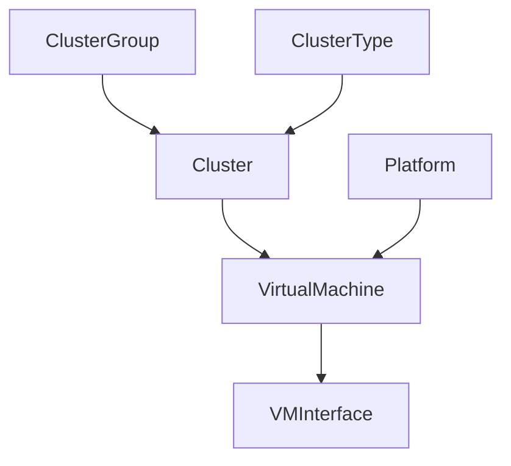

# 가상화

가상 머신과 클러스터는 물리적 인프라와 함께 NetBox에서 모델링할 수 있습니다. IP 주소 및 기타 리소스는 물리적 객체와 마찬가지로 이러한 객체에 할당되어 물리적 및 가상 네트워크 간의 원활한 통합을 제공합니다.

## 클러스터

클러스터는 가상 머신이 실행될 수 있는 하나 이상의 물리적 호스트 장비입니다. 각 클러스터에는 유형과 운영 상태가 있어야 하며 그룹에 할당될 수 있습니다. (유형과 그룹 모두 사용자 정의입니다.) 각 클러스터는 하나 이상의 장비를 호스트로 지정할 수 있지만 이는 선택 사항입니다.

## 가상 머신

가상 머신은 가상화된 컴퓨팅 인스턴스입니다. 이들은 NetBox에서 장비 객체와 매우 유사하게 동작하지만 물리적 속성은 없습니다. 예를 들어 VM에는 IP 주소와 VLAN이 할당된 인터페이스가 있을 수 있지만 인터페이스는 케이블을 통해 연결할 수 없습니다(가상이기 때문에). 각 VM은 컴퓨팅, 메모리 및 스토리지 리소스도 정의할 수 있습니다.
