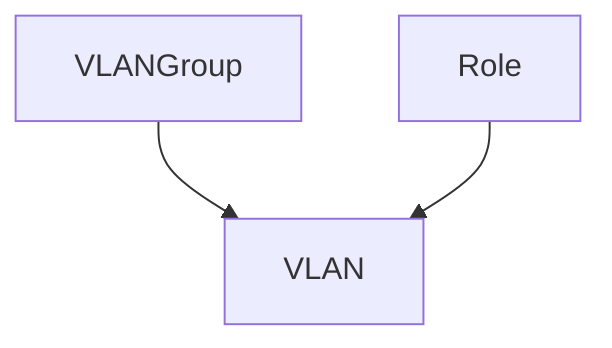

# VLAN 관리

IPAM 기능을 보완하여 NetBox는 레이어 2 네트워크 구성을 지원하기 위해 VLAN 정보도 추적합니다. VLAN은 IEEE 802.1Q 및 관련 표준에 따라 정의되며 그룹 및 기능 역할에 할당될 수 있습니다.

## VLAN 그룹

VLAN 그룹은 특정 범위 내에 정의된 VLAN의 모음입니다. 각 VLAN 그룹은 도메인을 나타내기 위해 특정 사이트, 위치, 랙 또는 유사한 객체와 연결될 수 있으며, 그룹 내 최소 및 최대 VLAN ID를 지정합니다. (기본적으로 이들은 각각 1과 4094의 표준 최소 및 최대 값입니다.)

그룹 내에서 각 VLAN은 고유한 ID와 이름을 가져야 합니다. 범위당 생성할 수 있는 그룹 수에는 제한이 없습니다.

## VLAN

NetBox는 12비트 VLAN ID와 이름으로 IEEE 802.1Q에 따라 VLAN을 모델링합니다. 각 VLAN에는 운영 상태도 있으며, 프리픽스와 마찬가지로 기능 역할이 할당될 수 있습니다. 각 VLAN은 VLAN이 존재하는 도메인을 전달하기 위해 VLAN 그룹 또는 사이트에 할당될 수 있습니다.

정의되면 VLAN을 장비 및 가상 머신 인터페이스와 연결할 수 있습니다. 각 인터페이스에는 802.1Q 모드(액세스 또는 태그)가 할당될 수 있으며, 관련 VLAN을 태그 또는 비태그로 적용할 수 있습니다.
