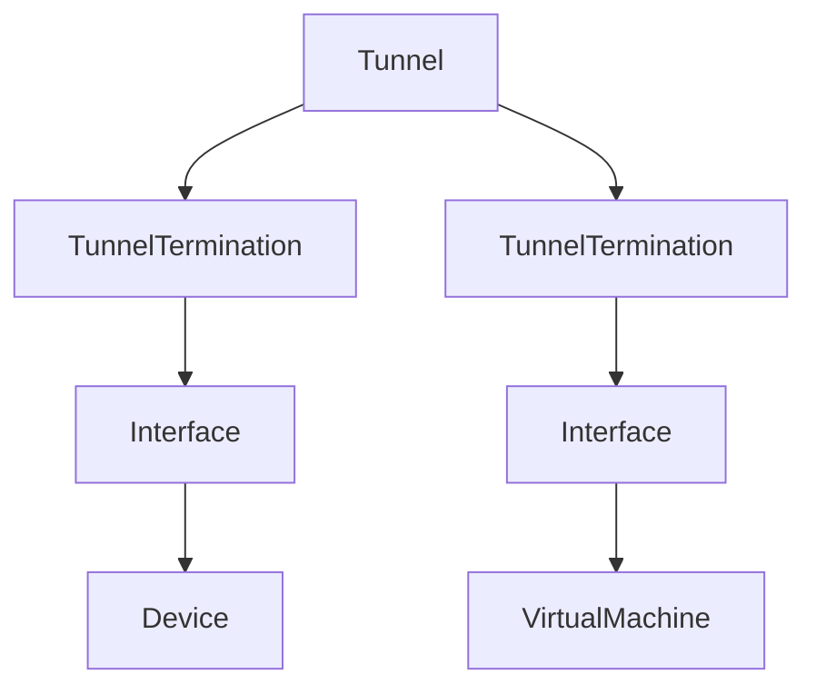
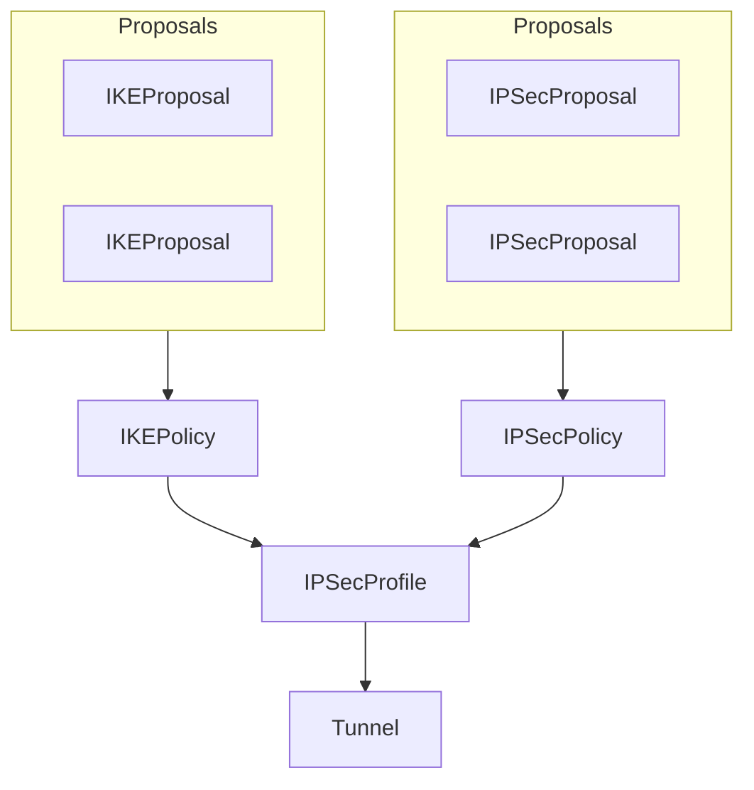

# 터널

NetBox는 네트워크 전체의 가상 종단 지점 간에 형성된 사설 터널을 모델링할 수 있습니다. 일반적인 터널 구현에는 GRE, IP-in-IP 및 IPSec이 포함됩니다. 터널은 두 개 이상의 장비 또는 가상 머신 인터페이스로 종단될 수 있습니다. 편리한 구성을 위해 터널을 사용자 정의 그룹에 할당할 수 있습니다.

# IPSec 및 IKE

NetBox에는 IPSec 및 IKE 정책 모델링을 위한 강력한 지원이 포함되어 있습니다. 이들은 IPSec 터널에 대한 암호화 및 인증 매개변수를 정의하는 데 사용됩니다.

