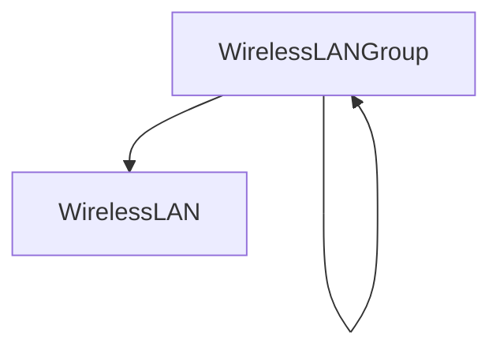

# 무선

NetBox가 물리적 케이블 배선에 대한 강력한 모델링을 제공하는 것처럼 무선 LAN 및 포인트 투 포인트 링크의 모델링도 지원합니다.

## 무선 LAN

무선 LAN은 공통 서비스 세트 식별자(SSID) 및 인증 매개변수로 식별되는 여러 무선 클라이언트가 공유하는 다중 접속 네트워크입니다. 무선 LAN은 자체 중첩 그룹으로 구성할 수 있으며, 각 무선 LAN은 선택적으로 특정 VLAN에 바인딩될 수 있습니다. 이를 통해 무선 네트워크를 유선 대응 네트워크에 쉽게 매핑할 수 있습니다.

무선 LAN의 인증 속성에는 다음이 포함됩니다:

* **유형** - Open, WEP, WPA 등
* **암호화** - Auto, TKIP 또는 AES
* **사전 공유 키(PSK)** - 모든 참여 클라이언트에 구성된 비밀 키

인증 매개변수의 정의는 선택 사항입니다.

## 무선 링크

무선 LAN이 임의 수의 클라이언트가 있는 물리적 다중 접속 세그먼트를 나타내는 반면, 무선 링크는 정확히 두 개의 스테이션 간의 포인트 투 포인트 연결입니다. 이러한 링크는 케이블처럼 작동하지만 무선 통신의 특성을 보다 정확하게 모델링합니다.

무선 LAN과 마찬가지로 무선 링크에도 SSID 및 (선택적) 인증 속성이 있습니다.
