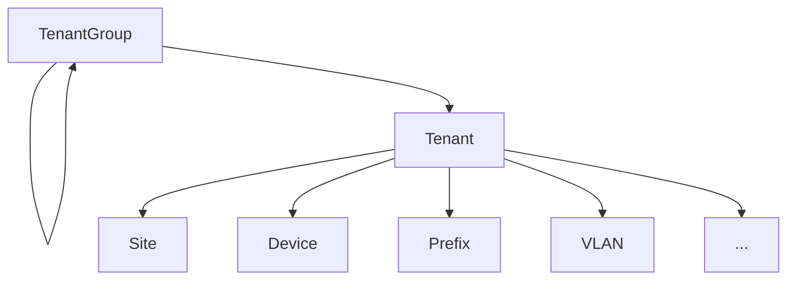
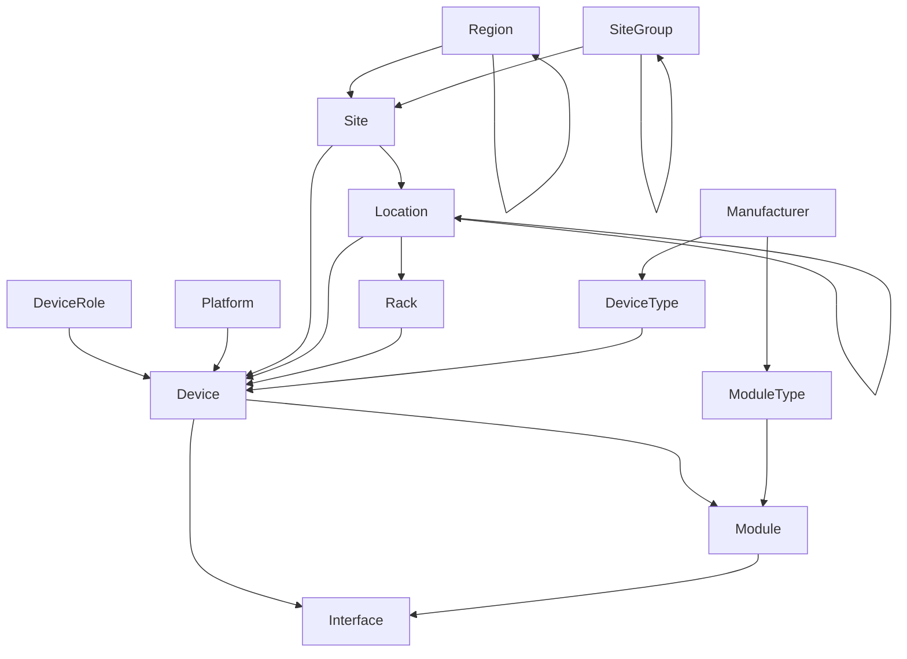
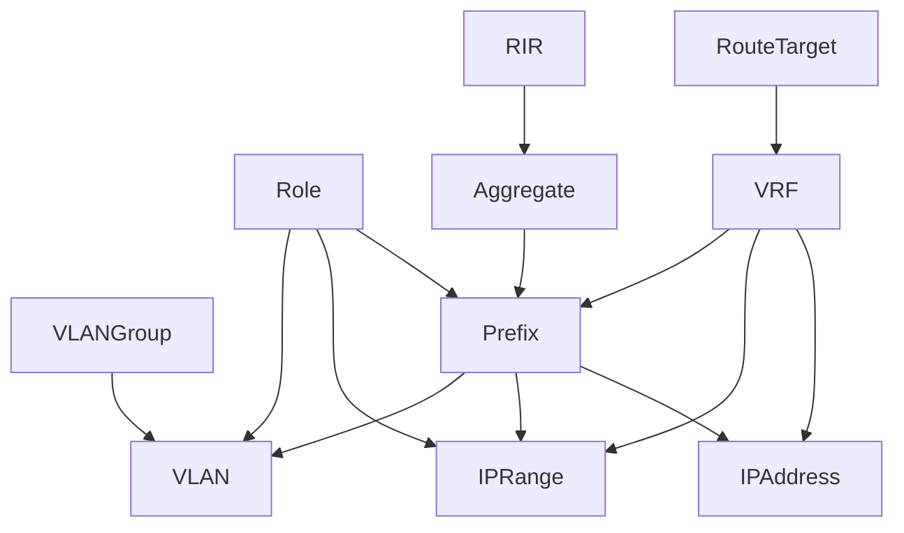
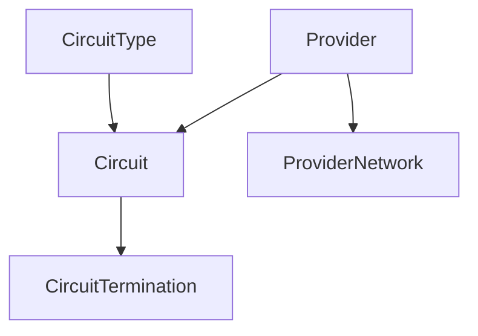
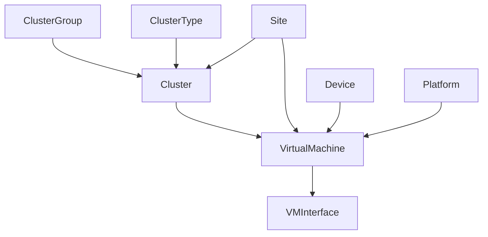

# 마이그레이션 계획하기

이 가이드는 NetBox로의 성공적인 마이그레이션을 계획하는 데 필요한 단계를 설명합니다. 완전히 새로운 설치를 기준으로 작성되었지만, 여기서 설명하는 일반적인 접근 방식은 기존 NetBox 배포에 새 데이터를 추가할 때도 동일하게 적용됩니다.

## 현재 신뢰 소스 파악하기

자체 데이터에 NetBox를 사용하기 전에, 먼저 기존 신뢰 소스가 어디에 있는지 파악하는 것이 중요합니다. "신뢰 소스(Source of Truth)"는 특정 도메인에 대해 권위 있는 데이터 저장소입니다. 예를 들어, 네트워크에서 사용 중인 모든 IP 프리픽스를 추적하는 스프레드시트가 있을 수 있습니다. 관련된 모든 사람이 이 스프레드시트가 전체 네트워크에 대해 _권위 있다_고 동의하는 한, 이것이 IP 프리픽스에 대한 신뢰 소스입니다.

다음 두 가지 조건을 충족하면 무엇이든 신뢰 소스가 될 수 있습니다:

1. 관련된 모든 당사자가 이 데이터 소스가 올바르다고 동의함
2. 적용되는 도메인이 명확하게 정의됨

<!-- TODO: Example SoT -->

인프라에 대한 자체 신뢰 소스를 파악하는 데 시간을 할애하세요. 이를 목록화하려고 할 때 다음과 같은 문제에 직면할 가능성이 높습니다:

* **특정 도메인에 대해 여러 개의 상충되는 소스**가 있는 경우. 예를 들어, 각각 상충되는 데이터 세트를 주장하는 여러 버전의 스프레드시트가 유통될 수 있습니다.
* **도메인이 정의되지 않은 소스**가 있는 경우. 조직 내 다른 팀이 동일한 목적으로 다른 도구를 사용하며, 어느 것을 언제 사용해야 하는지에 대한 정상적인 정의가 없을 수 있습니다.
* **접근하기 어려운 데이터 형식**. 일부 도구는 프로그래밍 방식으로 사용하기에 다른 도구보다 더 적합합니다. 예를 들어, 스프레드시트는 일반적으로 파싱하고 내보내기가 매우 쉽지만, 위키나 유사한 애플리케이션의 자유 형식 메모는 사용하기가 훨씬 더 어렵습니다.
* **신뢰 소스가 없는 경우**. 때로는 도메인에 대한 신뢰 소스가 단순히 존재하지 않는 경우가 있습니다. 예를 들어, IP 주소를 할당할 때 운영자가 사용 기록 없이 서브넷에서 사용 가능한(것으로 추정되는) IP를 그냥 사용할 수 있습니다.

조직의 각 인프라 데이터 도메인과 각각에 대한 신뢰 소스를 파악할 수 있는지 확인하세요. 이것들을 정리한 후에는 NetBox에 무엇이 들어가야 하는지 결정해야 합니다.

## 이동할 데이터 결정하기

NetBox에 어떤 데이터를 넣을지 결정할 때의 일반적인 규칙은 다음과 같습니다: 해당 모델이 있다면 NetBox에 속합니다. 예를 들어, NetBox에는 랙, 장비, 케이블, IP 프리픽스, VLAN 등을 위한 목적에 맞게 구축된 모델이 있습니다. 이것들은 사용하기가 매우 간단합니다. 그러나 NetBox 데이터 모델의 한계에 도달하고 NetBox에 기록하는 것이 적절한 추가 데이터에 대해 의문을 갖게 될 것입니다. 예를 들어, NetBox가 인프라 DNS 레코드나 DHCP 범위에 대한 신뢰 소스로 기능해야 하는지 궁금할 수 있습니다.

NetBox는 데이터 모델을 확장하기 위한 두 가지 핵심 메커니즘을 제공합니다. 첫 번째는 커스텀 필드입니다: NetBox의 대부분의 모델은 기본 제공 필드가 없는 추가 데이터를 보관하기 위한 커스텀 필드 추가를 지원합니다. 예를 들어, 장비 모델에 "인벤토리 ID" 필드를 추가할 수 있습니다. 두 번째 메커니즘은 플러그인입니다. 사용자는 NetBox에서 완전히 새로운 모델, 뷰, API 엔드포인트를 도입하는 자체 플러그인을 만들 수 있습니다. 이는 빠른 개발과 핵심 모델과의 긴밀한 통합을 가능하게 하므로 매우 강력할 수 있습니다.

그러나 데이터 도메인을 NetBox로 마이그레이션하는 것이 항상 적합한 것은 아닙니다. 예를 들어, 많은 조직이 NetBox의 IPAM 컴포넌트만 또는 DCIM 컴포넌트만 사용하고 다른 도메인에 대해서는 다른 신뢰 소스와 통합하는 것을 선택합니다. 이것은 완전히 유효한 접근 방식입니다(관련된 모든 사람이 각 도메인에 대해 어떤 도구가 권위 있는지에 동의하는 한). 궁극적으로 비네이티브 데이터 모델을 NetBox에 두는 것의 가치와 해당 모델을 정의하고 유지하는 데 필요한 노력을 비교해야 합니다.

NetBox가 지속적으로 개발 중이라는 점도 고려하세요. 현재 릴리스가 특정 유형의 객체를 지원하지 않더라도, 향후 릴리스에서 지원을 추가할 계획이 있을 수 있습니다. (그렇지 않다면 사용 사례를 인용하여 기능 요청을 제출하는 것을 고려하세요.)

## 기존 데이터 검증하기

데이터를 NetBox로 마이그레이션하기 전 마지막 단계가 가장 중요합니다: **검증**. GIGO(garbage in, garbage out - 쓰레기가 들어가면 쓰레기가 나온다) 원칙이 완전히 적용됩니다: 신뢰 소스는 보유한 데이터만큼만 좋습니다. NetBox에는 매우 강력한 데이터 검증 도구가 있지만(커스텀 검증 규칙 지원 포함), 궁극적으로 무엇이 올바르고 무엇이 아닌지를 판단하는 것은 인간 운영자의 몫입니다. 예를 들어, NetBox는 두 인터페이스 간 케이블 연결을 검증할 수 있지만, 케이블이 _있어야 하는지_는 말할 수 없습니다.

다음은 유효한 데이터만 NetBox로 가져오는 데 도움이 되는 몇 가지 팁입니다:

* 완전하고 잘 형식화된 데이터로 시작하세요. 최상의 이식성을 위해 JSON 또는 CSV를 강력히 권장합니다.
* 가져오기 전에 NetBox에서 커스텀 검증 규칙을 정의하는 것을 고려하세요. (예: 장비 명명 체계를 강제하기 위해)
* 커스텀 스크립트를 사용하여 패턴화된 데이터를 자동으로 채우세요. (예: 각 사이트에 대해 표준 VLAN 세트를 자동으로 생성하기 위해)

NetBox로 데이터를 가져오는 여러 가지 방법이 있으며, 다음 섹션에서 다룰 것입니다.

## 작업 순서

완전히 빈 데이터베이스로 시작할 때 어디서부터 시작해야 할지 즉시 명확하지 않을 수 있습니다. NetBox의 많은 모델은 다른 유형의 사전 생성에 의존합니다. 예를 들어, 제조업체를 먼저 생성한 후에야 장비 타입을 생성할 수 있습니다.

아래는 NetBox 객체를 생성하거나 가져오는 (대략적인) 권장 순서입니다. 이 정확한 순서를 따를 필요는 없지만, 이렇게 하면 가장 원활한 워크플로우를 보장하는 데 도움이 됩니다.

1. 테넌트 그룹 및 테넌트
2. 지역, 사이트 그룹, 사이트 및 로케이션
3. 랙 역할 및 랙
4. 제조업체, 장비 타입 및 모듈 타입
5. 플랫폼 및 장비 역할
6. 장비 및 모듈
7. 제공업체, 제공업체 계정 및 제공업체 네트워크
8. 회선 타입 및 회선
9. 무선 LAN 그룹 및 무선 LAN
10. 라우트 타겟 및 VRF
11. RIR 및 어그리게이트
12. IP/VLAN 역할
13. 프리픽스, IP 범위 및 IP 주소
14. VLAN 그룹 및 VLAN
15. 클러스터 타입, 클러스터 그룹 및 클러스터
16. 가상 머신 및 VM 인터페이스

이것은 포괄적인 목록은 아니지만, 초기 데이터 가져오기에는 충분합니다. 이것들 외에는 객체를 추가하는 순서가 거의 또는 전혀 영향을 미치지 않습니다.

아래 그래프는 참조용으로 NetBox의 다른 모델 간 핵심 종속성 중 일부를 보여줍니다.

!!! note "자기 중첩 모델"
    아래 그래프에서 자신을 가리키는 루프 화살표가 있는 각 모델은 재귀적 계층 구조로 중첩될 수 있습니다. 예를 들어, 국가와 도시를 모두 나타내는 지역을 가질 수 있으며, 후자가 전자 아래에 중첩됩니다.

### 테넌시

### 사이트, 랙 및 장비

### VRF, 프리픽스, IP 주소 및 VLAN

### 회선

### 클러스터 및 가상 머신

